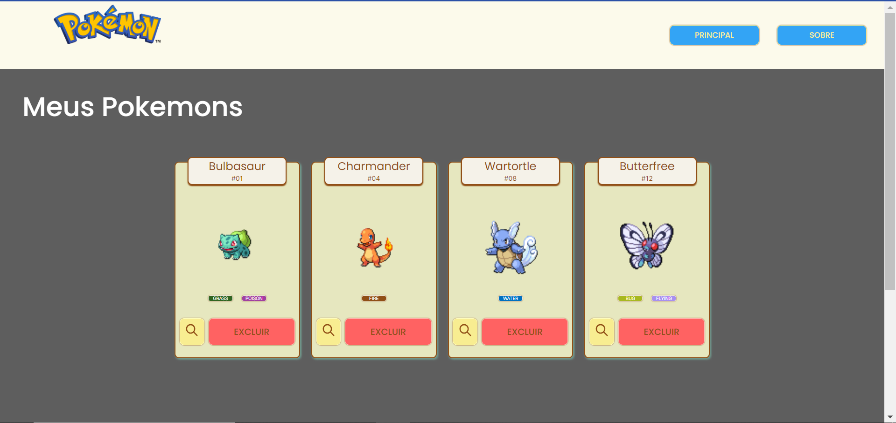
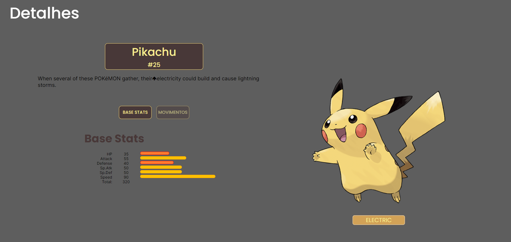
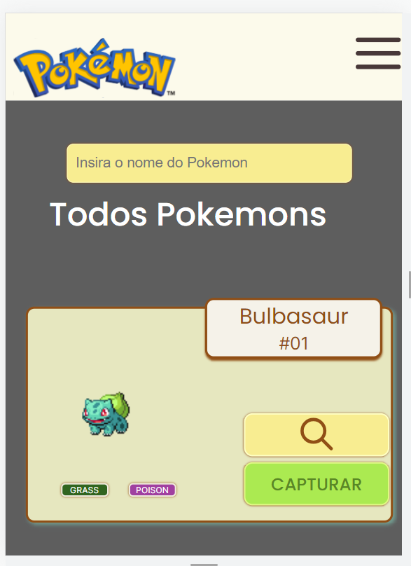

 # Projeto Pokédex
 

 A Pokédex foi o projeto final do módulo de front-end do bootcamp da Labenu. O objetivo central consistia em criar uma plataforma que permitisse a captura e exclusão de Pokémons, abrangendo os seguintes tópicos:

- Integração com a PokeAPI;
- Implementação de paginação;
- Utilização de custom hooks;
- Integração com o React Router;
- Gerenciamento de estado global.

Através da aplicação desses conceitos, a Pokédex foi desenvolvida de forma integral.

## Funcionalidades do projeto
O projeto consiste em um conjunto de três páginas: Home, Pokedex e Página de Detalhes.

Página Home:
Nessa página, o usuário é apresentado a uma lista de Pokémon obtida através da API de Pokémons. Cada item da lista é representado por um card, permitindo que o usuário clique em qualquer um deles para adicionar o respectivo Pokémon à sua Pokedex.

Página Pokedex:
Aqui, o usuário pode visualizar todos os Pokémon que foram adicionados à sua Pokedex durante a interação na página Home.

Página de Detalhes do Pokémon:
Os detalhes específicos de um Pokémon podem ser acessados ao clicar em um card, tanto na página Home quanto na Pokedex. Isso proporciona ao usuário informações mais abrangentes sobre o Pokémon escolhido.

## Tecnologias utilizadas
- React;
- React Router;
- Styled-components;
- React Context;
- Axios.

## Requisitos para rodar o projeto
- Node.js;
- npm.

## Inicialização do projeto
#### Instalando dependências 
- npm install;

#### Executando o projeto
- npm start.

## Layout para Desktop

## Layout para Mobile

